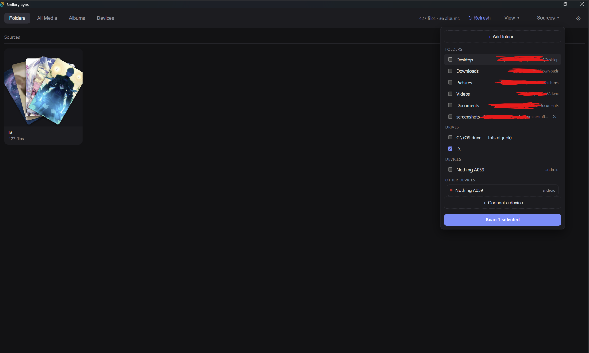
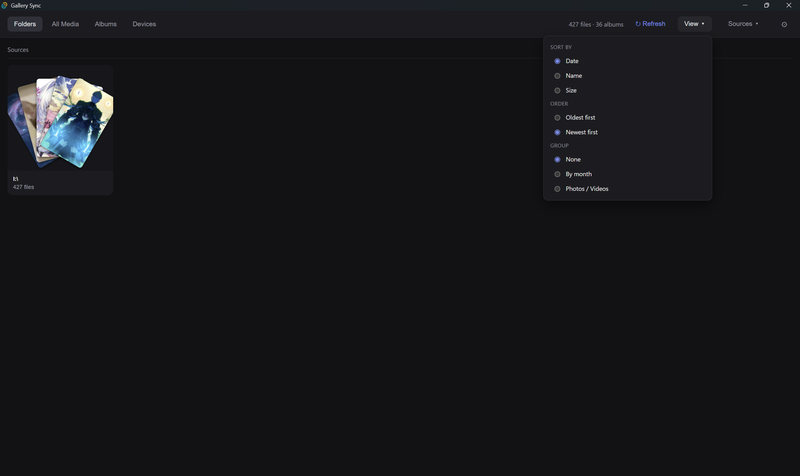
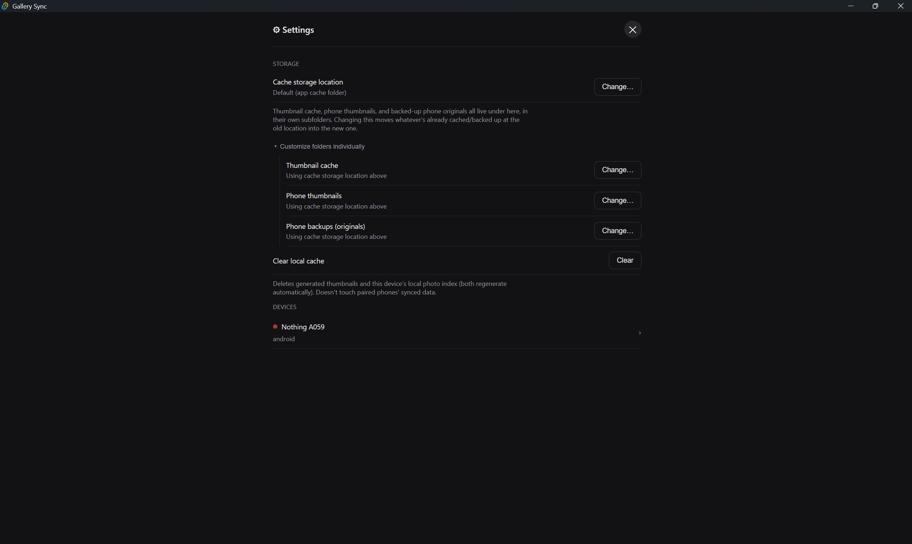
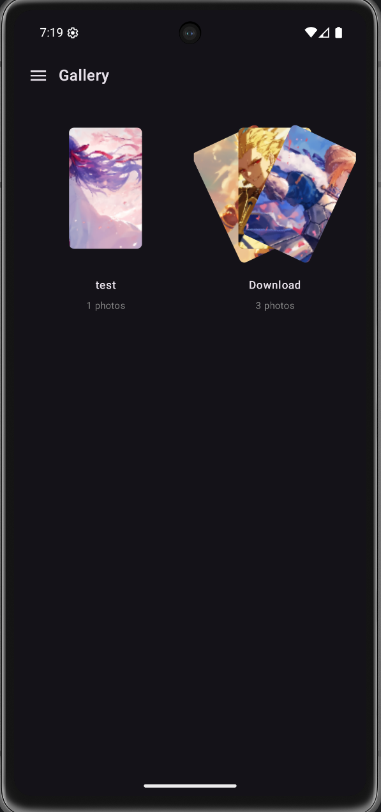
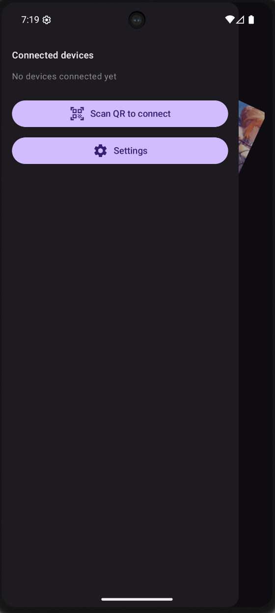
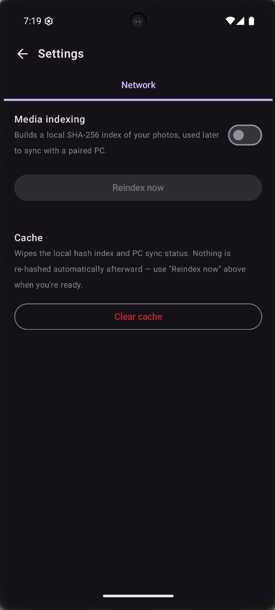

its private till i publish to the appstore this repo is just so my website picks it up

# Gallery Sync

## Overview

A cross-platform photo/video gallery that syncs a personal media library
between an Android phone and a Windows desktop — entirely over the local
network, no cloud relay or third-party server involved. Pairing happens via
a QR code scanned on the phone; the connection is `wss://` only, secured
with a self-signed certificate whose public key the phone pins directly
(no CA chain to trust).

Each side works as a full standalone gallery on its own — folder/album
browsing, a virtualized staggered grid, a fullscreen viewer, file
operations (delete/rename/move/copy) — before sync ever enters the
picture. Once paired, the phone streams a hash-based catalog of its media
to the PC (so renamed/duplicate files are recognized by content, not
filename), followed by thumbnails, so the phone's library shows up
merged into the desktop's own Folders/Albums/All Media views. Full-resolution
originals move over on request rather than automatically: the phone can
push one back at a time from its own viewer, or the desktop can multi-select
photos in its grid (press-and-drag across tiles to select, same gesture as
Google Photos' web grid) and ask the phone to back up exactly those.

The goal is a phone-storage-freeing backup tool that never depends on
anything but the two devices being on the same network.

## Screenshots

| | |
|---|---|
|  Sources panel — folders, drives, and paired devices, all as scan sources |  Sort/group options |
|  Desktop settings — cache location, per-device management |  Android gallery — folder view |
|  Android — connected devices / pairing |  Android — indexing & cache settings |

## Tags

`Kotlin` · `Jetpack Compose` · `Rust` · `Tauri` · `React` · `TypeScript` · `WebSocket` · `TLS` · `SQLite`

## Architecture

```
Android App  <──── wss:// (LAN, pinned self-signed TLS) ────>  Desktop App
    │                                                                │
  Gallery UI (Compose)                                    Gallery UI (React)
    │                                                                │
  SyncClient (network module)                          sync server (axum + rustls)
    │                                                                │
  media_index.db (SHA-256 hash index, phone-local)          catalog.db (SQLite, PC-local)
                                                        + on-disk thumbnail/original cache
```

- **Pairing**: PC renders a QR (LAN IP, port, one-off session token, TLS
  public-key fingerprint); phone scans and dials `wss://`.
- **Catalog sync**: phone hashes its media (SHA-256, opt-in/manual — never
  automatic, to protect battery), sends a paged, delta-aware catalog; the PC
  diffs against what it already has.
- **Thumbnails**: PC auto-requests previews for anything unsent right after
  a successful pairing/reconnect; phone streams them continuously.
- **Originals (backup)**: full-resolution files move only on explicit
  request — either the phone pushing one via its own cloud-icon action, or
  the PC pushing a `backup_request` for a multi-selected batch through a
  live-connection registry that reaches directly into the phone's open
  socket.
- **Everything phone-sourced is additive, never destructive**: a file
  deleted on the phone is not deleted from the PC's backup — this is a
  backup tool, not a mirror.

## Tech Stack

| Component           | Choice                                        |
|----------------------|-----------------------------------------------|
| Android frontend     | Kotlin + Jetpack Compose                       |
| Android networking   | OkHttp WebSocket + custom TLS public-key pinning |
| Phone-local storage  | Room/SQLite (`media_index.db`)                 |
| Desktop frontend     | React + TypeScript (Vite)                      |
| Desktop backend      | Rust (Tauri, axum, rustls, tokio)              |
| PC-local storage     | SQLite (`catalog.db`, via `rusqlite`)          |
| Transport            | Direct LAN `wss://` — no relay, no cloud       |
